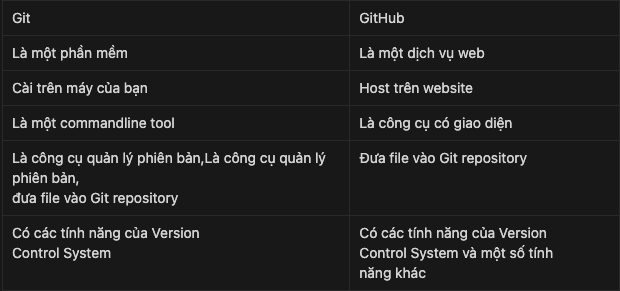
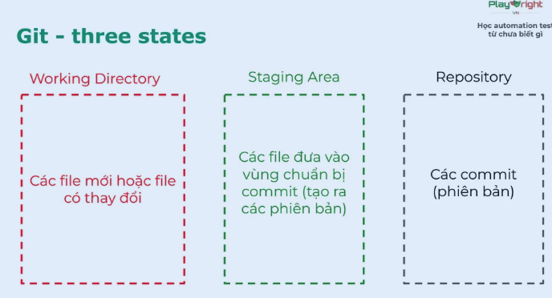
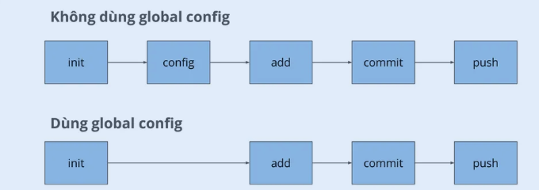

# GIT

## Version control system
- Hệ thống quản lý các phiên bản 
- Có thể check được ai đang làm gì, ai đang sửa gì 
- Có 3 loại
    1. Local: lưu ở máy cá nhân 
    2. Centralize: lưu ở 1 máy chủ chung 
    3. Distributed: lưu ở nhiều máy khác nhau


## Git Config Cơ Bản

- **Username**  
  `git config --global user.name "Tên của bạn"`

- **Email**  
  `git config --global user.email "email@example.com"`

- **Branch mặc định**  
  `git config --global init.defaultBranch main`


## Kết nối GitHub bằng SSH

### SSH key gồm 2 phần:
- `id_rsa`: **bí mật**, không chia sẻ
- `id_rsa.pub`: **có thể chia sẻ**, dùng để gửi lên GitHub

→ Giúp xác thực đăng nhập dễ dàng, không cần nhập mật khẩu mỗi lần.

Tạo SSH Key
```bash
ssh-keygen -t rsa -b 4096 -C "your_email@example.com"
```

## Git & GitHub



## Three-states

 

### Git workflow




## Git Commands Cheat Sheet

### 1. Add file

```bash
git add <file name>
git add .        # add all files in current directory
```

### 2. Restore file từ staging → working directory

```bash
git restore --staged <file>
```

### 3. Reset commit (repository → working directory)

```bash
git reset HEAD~<số lượng commit>
git reset HEAD~2
```

### 4. Commit changes

```bash
git commit -m "initial commit"
```

### 5. Check status

```bash
git status
```

### 6. View commit history

```bash
git log
```

### 7. Cấu hình danh tính

```bash
git config --global user.name "Your name"
git config --global user.email "your.email@example.com"
```

---

## Working with Remote Repositories

### 1. Clone repo

```bash
git clone <URL>
```

### 2. Push changes

```bash
git push origin <branch_name>
```

### 3. Pull updates

```bash
git pull origin <branch_name>
```

---

## Git Branching

### 1. Tạo branch mới

```bash
git branch <new-branch>
```

### 2. Xem tất cả branch

```bash
git branch
```

### 3. Chuyển branch

```bash
git checkout <branch name>
```

### 4. Tạo và chuyển ngay sang branch

```bash
git checkout -b <branch name>
```

### 5. Xoá branch

```bash
git branch -d <branch name>
```

### 6. Gộp branch

```bash
git merge <branch name>
```

---

## Git Undo

### 1. Revert

```bash
git revert HEAD --no-edit
```

### 2. Reset theo commit hash

```bash
git reset <commit_hash>
```

### 3. Sửa message commit gần nhất

```bash
git commit --amend -m "<new commit message>"
```

---

### 4 .gitignore

Dùng để **bỏ qua các file không cần theo dõi** (log, thư viện, file tạm...).  

```gitignore
Ignore file   <file_name>
Ignore folder <folder_name>
```
