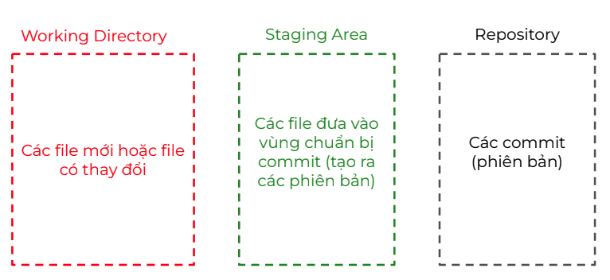

 
# Version control system
- Hệ thống quản lý các phiên bản 
- Có thể check được ai đang làm gì, ai đang sửa gì 
- Có 3 loại
    1. Local: lưu ở máy cá nhân 
    2. Centralize: lưu ở 1 máy chủ chung 
    3. Distributed: lưu ở nhiều máy khác nhau


# Git 

- **Ưu Điểm** 
    1. Tính năng: Dễ dùng, có nhiều tính năng vượt trội: branching tốc độ xử lý nhanh
    2. Chi phí: Free
    3. Phổ biến: nhiều công ty sử dụng

## Git & GitHub


## Three-states



## Git workflow


## Git config
- **Username**  
  `git config --global user.name "Tên của bạn"`

- **Email**  
  `git config --global user.email "email@example.com"`

- **Branch mặc định**  
  `git config --global init.defaultBranch main`

## Git Commands Cheat Sheet

### 1. Khởi tạo repo
```bash
git init
```

### 2. Tạo repo GitHub và liên kết tới repo local
```bash
git remote add origin <url>
```

### 3. Add file

```bash
git add <file name>
git add .        # add all files in current directory
```

### 4. Commit file

```bash
git commit -m ”<message>”
```

### 5. Push code

```bash
git push origin main
```

### 6. Xem trạng thái file

```bash
git status  #File màu xanh: vùng staging. File màu đỏ: vùng working directory
```

### 7. Kiểm tra danh sách commit:

```bash
git log
```

# JavaScript
##  In ra "Hello World"

```javascript
console.log("Hello World");
```

>  Format code nhanh: `Option + Shift + F` (trên Mac)

---

##  Biến trong JavaScript

### Khai báo biến

```javascript
var firstname = "Quyen";
var lastname = "Nguyen";
console.log(firstname + "." + lastname);
```

### Khác nhau giữa `var` và `let`

```javascript
var firstname = "Xu";   // Có thể khai báo lại
let age = "23";         // Không thể khai báo lại trong cùng scope
console.log(firstname + " " + age);
```

### Hằng số: `const`

```javascript
const name = "my my";
const ages = 22;
```

> Ghi nhớ:
> - `var` / `let`: Dùng cho biến có thể thay đổi
> - `const`: Biến không thay đổi
> - Hạn chế dùng `var`, ưu tiên `let` và `const`

---

##  Kiểu Dữ Liệu (Data Types)

```javascript
const address = "quyen";          // String
const number = 12;                // Number
const isDisplayed = false;        // Boolean

const myname = "haha";
const isLearningPlaywright = true;
const price = 200;

// Các kiểu khác:
// - BigInt
// - Undefined
// - Null
// - Symbol
// - Object
```

---

##  Toán tử So sánh (Comparison Operators)

> Trả về kết quả `true` hoặc `false`

```javascript
const a = 10;
const b = 11;

const result = a > b;
console.log(result);
```

### Các loại toán tử:
- Lớn hơn, nhỏ hơn: `>`, `<`
- So sánh bằng: `==`, `===`
- So sánh khác: `!=`, `!==`
- So sánh lớn hơn hoặc bằng: `>=`, `<=`

> 🔸 `===` → So sánh cả **giá trị** và **kiểu dữ liệu**  
> 🔹 `==` → Chỉ so sánh **giá trị**

---

##  Toán tử một ngôi (Unary Operators)

- Dùng để tăng/giảm giá trị của biến
-  Prefix: toán tử nằm ở phía trước - tăng trước, trả về sau
      -   ++x ;
      -   --x ;
-  Postfix: toán tử nằm ở phía sau - trả về trước, tăng sau
      -   x++ ;
      -   x-- ;
      

```javascript
let i3 = 10;
i3 = i3 + 1;
i3++;
console.log(i3); // 12

let i1 = 10;
i1 = i1 - 1;
i1--;
console.log(i1); // 8
```

---

##  Toán tử số học (Arithmetic Operators)

```javascript
+   // Cộng
-   // Trừ
*   // Nhân
/   // Chia
```

---

##  Câu lệnh điều kiện (Conditional Statement)

```javascript
if (5 < 9) {
    console.log("tao lao");
}
```

---

##  Vòng lặp (Loops)

```javascript
for (let i = 1; i < 8; i++) {
    console.log(i); 
}
```


